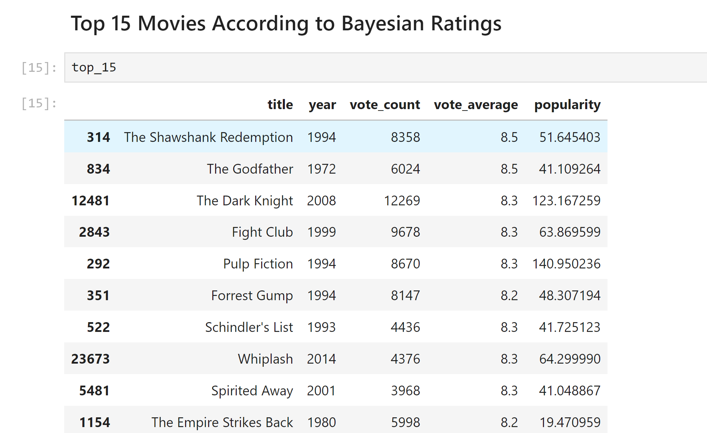
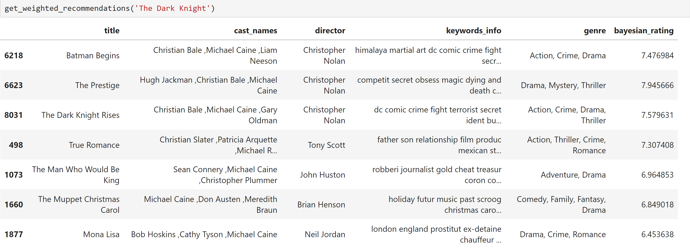
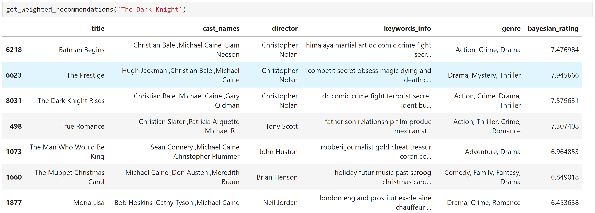

# Movie Recommendation System

## Author:
- Satvik Pandey

## Project Description
This project focuses on building a comprehensive movie recommendation system using various recommendation techniques. It incorporates multiple approaches to generate personalized movie recommendations for users based on their preferences and past interactions. The project uses data from the MovieLens dataset and The Movie Database (TMDB) API to provide up-to-date movie information.

## Methodology
The project implements several recommendation algorithms, ranging from simple recommenders to more complex hybrid systems that combine different techniques.

1. **Simple Recommender (Bayesian Approach):**
   - Recommends movies based on their popularity and ratings using the Bayesian average technique. This recommender does not take user preferences into account but provides generalized movie recommendations.

2. **Content-Based Recommender:**
   - **Overview and Tagline:** This recommender uses movie overviews and taglines to find similarities between movies using a TF-IDF vectorizer.
   - **Cast, Crew, and Keywords:** Another content-based recommender that focuses on movie metadata such as the director, cast, crew, and keywords to recommend similar movies. Additionally, the weight assigned to different features (cast, crew, genre, and keywords) can be tuned based on the user's preferences or the importance of these features in the recommendation system. This allows for more tailored recommendations by emphasizing certain aspects like the cast or genre, depending on the desired outcome. Also, filter the movie based on top 60% number of votes in the database combined with popularity to show only the top movies.
   - **Latent Semantic Analysis (LSA):** This approach uses the combination of movie overviews and taglines with LSA, which reduces the dimensionality of the data to identify underlying patterns in movie descriptions.
   - **TF-IDF & Word2Vec Combination (Word Embeddings):** A hybrid content-based recommender that combines the strengths of TF-IDF for understanding term importance and Word2Vec to capture semantic relationships between words in the movie descriptions.

3. **Boltzmann Machine:**
   - A simple collaborative filtering algorithm that uses only user ratings to generate personalized recommendations. The Boltzmann recommender looks for patterns in user behavior to suggest movies based on their past ratings.

4. **Hybrid Recommender:**
   - This approach combines collaborative filtering and content-based filtering. It takes into consideration both user ratings (as in the Boltzmann recommender) and movie features such as the director, cast, crew, and keywords. This hybrid recommender provides more accurate recommendations by leveraging both user preferences and movie metadata.

## Project Structure
- `data/`: Contains the CSV file, including `id` and `TMDBId` of the movies used from the MovieLens dataset.
- `images/`: Contains screenshots showing the recommendations generated by the system.
- `Movie Recommendation System.ipynb`: The main Jupyter notebook containing all the recommenders and the steps for data preprocessing, model building, and evaluation.
- `Data Collector.ipynb`: A notebook for downloading the latest movie data from TMDB, which keeps the recommendation system up to date with newly released movies.

## Requirements
- Python 3.8+
- Pandas
- Numpy
- Scikit-learn
- Word2Vec (from Gensim)
- Matplotlib
- Seaborn
- TMDB API
- MovieLens Dataset

## Results
The project showcases various recommendation approaches, and the hybrid recommender proved to be highly effective by combining both user preferences and movie metadata. Below are some sample images of the recommendations generated:

| Simple Recommender | Content-Based (Overview & Tagline) |
| ------------------ | --------------------------------- |
|  |  |

| Content-Based (Crew & Cast(Most -weightage)) | Hybrid Recommender |
| --------------------- | ------------------ |
|  |  |

## Further Improvements
1. **Enhance the Collaborative Filtering Model:** Future work could explore using more sophisticated collaborative filtering algorithms, such as matrix factorization methods like Singular Value Decomposition (SVD) or Alternating Least Squares (ALS), to improve the quality of recommendations.
   
2. **Incorporate Temporal Dynamics:** Adding temporal factors, such as when the ratings were provided, could improve the relevance of recommendations by accounting for evolving user preferences over time.

3. **User Personalization with Implicit Feedback:** Incorporating implicit feedback (like clicks, watch time, etc.) along with explicit ratings could make the system more responsive to subtle user preferences.

4. **Deep Learning Models:** Implementing neural networks, such as deep content-based or collaborative filtering networks, could further enhance the accuracy and scalability of the recommendation system.

By continuing to develop and refine the recommendation algorithms, this system can offer highly personalized movie recommendations to users and stay current with the latest movie releases.
